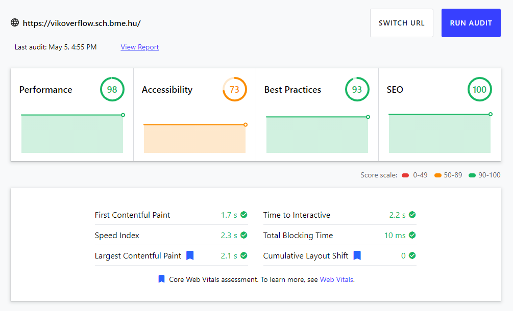
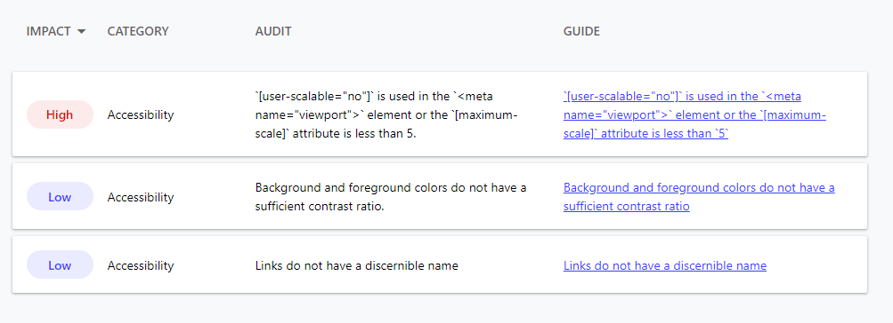
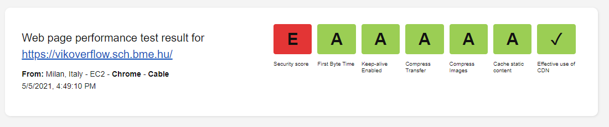
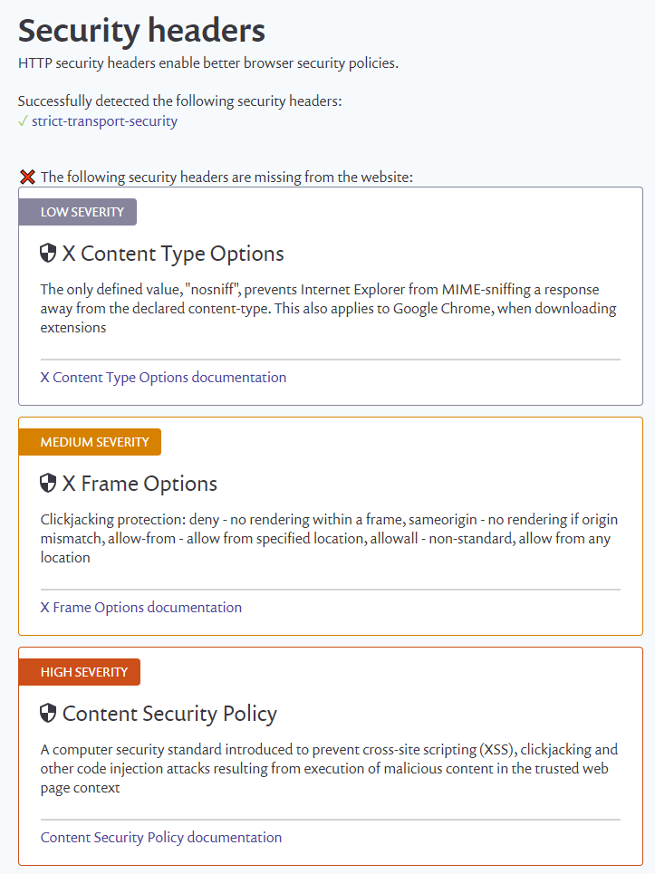

# Non-functional tests

## Web.dev measurements

With the help of https://web.dev/measure/ we measured how the application performs in different aspects. The site gives us scores for the Performance, Accessibility Best Practices and SEO aspects.

<figure><figcaption>The results</figcaption></figure>

The page produced desirable results, the only field where the we should consider some changes was the Accessiblity.
The application prohibits zooming on the pages, wich could be problematic for users with low vision. Even though the website was made for university students, we should make it accessible for everyone.

<figure><figcaption>Accessiblity notes</figcaption></figure>

Another point, where we could improve the application is the choice of colours. Witc better contrast ratio, the site would be better to look at for longer periods of time.

## Webpagetest.org results

We also checked the site with another web tool. The results were the following:

<figure><figcaption>The results</figcaption></figure>

Here the results were also promosing with the exception of Security. The used Javascript libraries were safe, however there were some missing HTTP security headers. The page listed some examples, to choose from.

<figure><figcaption>Security issues</figcaption></figure>
